## 📝 Description

**HandyRec** is a package for deep-learning recommendation models implemented with **TF2.6** ✨. It is meant to be an **easy-to-use** and **easy-to-read** package for people who want to use or learn classic deep-learning recommendation models.

It is currently a personal project for learning purposes. I recently started to learn deep-learning recommendation algorithms and design patterns💦. I'll try to implement some classical algorithms along with example notebooks here.

## 💡Models

### Matching

| Model      | Paper                                                                                                                 | Example                                                                                                                                                    |
| :--------- | :-------------------------------------------------------------------------------------------------------------------- | :--------------------------------------------------------------------------------------------------------------------------------------------------------- |
| YouTubeDNN | \[RecSys 2016] [Deep Neural Networks for YouTube Recommendations](https://dl.acm.org/doi/pdf/10.1145/2959100.2959190) |  |
| DSSM       | \[CIKM 2013] [Learning Deep Structured Semantic Models for Web Search using Clickthrough Data](https://www.microsoft.com/en-us/research/wp-content/uploads/2016/02/cikm2013_DSSM_fullversion.pdf)|   |

### Ranking

| Model      | Paper                                                                                                                    | Example                                                                                                                                                    |
| :--------- | :----------------------------------------------------------------------------------------------------------------------- | :--------------------------------------------------------------------------------------------------------------------------------------------------------- |
| YouTubeDNN | \[RecSys 2016] [Deep Neural Networks for YouTube Recommendations](https://dl.acm.org/doi/pdf/10.1145/2959100.2959190)    |  |
| DeepFM     | \[IJCAI, 2017] [DeepFM: A Factorization-Machine based Neural Network for CTR Prediction](https://arxiv.org/pdf/1703.04247.pdf) |  |
| DIN     | \[SIGKDD, 2018] [Deep Interest Network for Click-Through Rate Prediction](https://arxiv.org/pdf/1706.06978.pdf) |  |
| DIEN     | \[AAAI, 2019] [Deep Interest Evolution Network for Click-Through Rate Prediction](https://arxiv.org/pdf/1809.03672.pdf) |  |

## ℹ️ Usage

The main usage flow is shown below:

For more details, examples can be found [here](https://github.com/Wp-Zhang/HandyRec/tree/master/examples) and the table above. Documentation can be found [here](handyrec.readthedocs.io/).

> NOTE: This project is under development and has not been packaged yet😣. Please download the source code and import it as a local module. 🚧 I'll package this project when >10 models are implemented.

## 🛎️ Acknowledgments

Especially thanks to [DeepMatch](https://github.com/shenweichen/DeepMatch) and [DeepCTR](https://github.com/shenweichen/DeepCTR). I got much inspiration about code structure and model implementation from these projects.

The logo of this project is inspired by [AdobeLogoMaker](https://www.adobe.com/express/create/logo).
