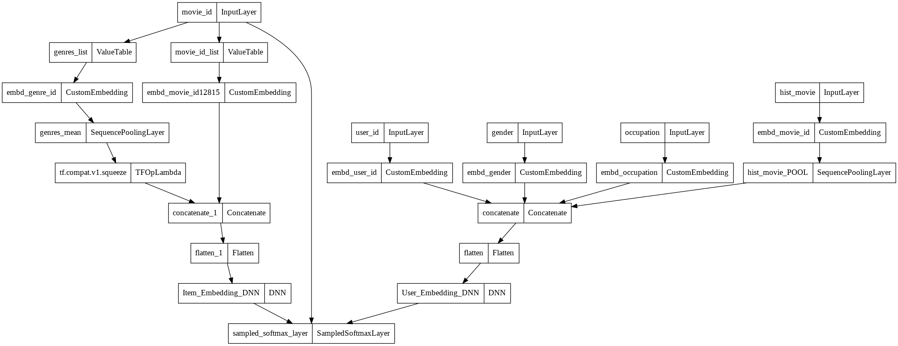
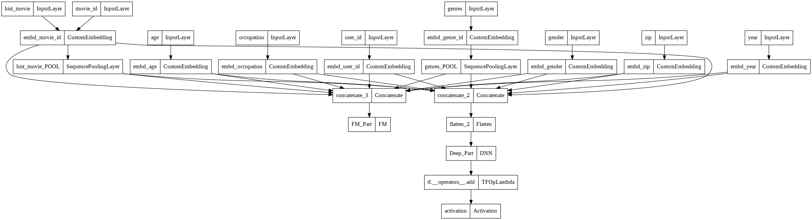

[](https://colab.research.google.com/github/Wp-Zhang/HandyRec/blob/master/examples/QuickstartDemo.ipynb)

# Quick-Start

In this demo, we'll use `DSSM` and `DeepFM` to perform candidate generating and ranking on MovieLens1M dataset.

## Prepare

This project is under development and has not been packaged yet😣, thus we have to import it as a local module.

1. download the source code
```bash
git clone https://github.com/Wp-Zhang/HandyRec.git
```


```python
! git clone https://github.com/Wp-Zhang/HandyRec.git
```

    Cloning into 'HandyRec'...
    remote: Enumerating objects: 1704, done.
    remote: Counting objects: 100% (1704/1704), done.
    remote: Compressing objects: 100% (1269/1269), done.
    remote: Total 1704 (delta 682), reused 1309 (delta 383), pack-reused 0
    Receiving objects: 100% (1704/1704), 20.92 MiB | 27.02 MiB/s, done.
    Resolving deltas: 100% (682/682), done.
    

2. add the project location to system path so that we can import it as a local module


```python
import sys
sys.path.append('./HandyRec/')
```

The next step is downloading the dataset:
```bash
wget https://files.grouplens.org/datasets/movielens/ml-1m.zip -O ./ml-1m.zip
unzip -o ml-1m.zip
```


```python
!wget https://files.grouplens.org/datasets/movielens/ml-1m.zip -O ./ml-1m.zip
!unzip -o ml-1m.zip
```

    --2022-04-15 22:12:34--  https://files.grouplens.org/datasets/movielens/ml-1m.zip
    Resolving files.grouplens.org (files.grouplens.org)... 128.101.65.152
    Connecting to files.grouplens.org (files.grouplens.org)|128.101.65.152|:443... connected.
    HTTP request sent, awaiting response... 200 OK
    Length: 5917549 (5.6M) [application/zip]
    Saving to: ‘./ml-1m.zip’
    
    ./ml-1m.zip         100%[===================>]   5.64M  17.9MB/s    in 0.3s    
    
    2022-04-15 22:12:35 (17.9 MB/s) - ‘./ml-1m.zip’ saved [5917549/5917549]
    
    Archive:  ml-1m.zip
       creating: ml-1m/
      inflating: ml-1m/movies.dat        
      inflating: ml-1m/ratings.dat       
      inflating: ml-1m/README            
      inflating: ml-1m/users.dat         
    


```python
!pip install faiss-gpu #faiss-cpu
```

    Collecting faiss-gpu
      Downloading faiss_gpu-1.7.2-cp37-cp37m-manylinux_2_17_x86_64.manylinux2014_x86_64.whl (85.5 MB)
         |████████████████████████████████| 85.5 MB 134 kB/s 
    [?25hInstalling collected packages: faiss-gpu
    Successfully installed faiss-gpu-1.7.2
    

## Import modules


```python
from handyrec.data.movielens import MovielensDataHelper
from handyrec.data.utils import gen_sequence
from handyrec.data import PointWiseDataset

from handyrec.layers.utils import sampledsoftmaxloss
from handyrec.models.retrieval import DSSM
from handyrec.models.ranking import DeepFM
from handyrec.features import DenseFeature, SparseFeature, SparseSeqFeature, FeatureGroup, EmbdFeatureGroup, FeaturePool
from handyrec.data.metrics import map_at_k, recall_at_k
from handyrec.models.utils import search_embedding

import tensorflow as tf
from tensorflow.keras import Model
from tensorflow.keras.losses import binary_crossentropy
from tensorflow.keras.utils import plot_model
import numpy as np
import pandas as pd
import gc
```


```python
import warnings
warnings.filterwarnings('ignore')
```

## Prepare data for matching

Load data into a dictionary with three keys: `user`, `item`, and `interact`, then generate a movie watching history sequence with a length of `40` for each user.


```python
retrieve_dh = MovielensDataHelper('./ml-1m/')
data = retrieve_dh.get_clean_data(sparse_features=['gender','occupation','zip','age','year'])
data['inter']['hist_movie'] = gen_sequence(data['inter'], 'user_id', 'movie_id', 40)
```

    Encode User Sparse Feats: 100%|██████████| 4/4 [00:00<00:00, 40.85it/s]
    Encode Item Sparse Feats: 100%|██████████| 1/1 [00:00<00:00, 77.33it/s]
    Generate movie_id sequence: 100%|██████████| 6040/6040 [00:09<00:00, 668.65it/s] 
    


```python
user_features = ['user_id', 'gender', 'occupation']
item_features = ['movie_id','genres']
inter_features = ['hist_movie']
```

Only movies with ratings larger than `3` are treated as 'positive' samples for each user. Every last `10` 'positive' movies of each user are held out for testing and `10%` of the train set is split out for validating.

As we'll use sampled softmax in the training process of the retrieval model, we don't need to generate negative samples by ourselves here.


```python
retrieval_dataset = PointWiseDataset(
    "RetrievalDataset",
    task="retrieval",
    data=data,
    uid_name="user_id",
    iid_name="movie_id",
    inter_name="interact",
    time_name="timestamp",
    threshold=4,
)

retrieval_dataset.train_test_split(10)
retrieval_dataset.train_valid_split(0.1)
retrieval_dataset.gen_dataset(user_features, item_features, inter_features, shuffle=False)
```

    Save user features: 100%|██████████| 3/3 [00:02<00:00,  1.25it/s]
    Save item features: 100%|██████████| 2/2 [00:02<00:00,  1.04s/it]
    Save inter features: 100%|██████████| 2/2 [00:04<00:00,  2.08s/it]
    


```python
train_data, valid_data, test_data, test_label = retrieval_dataset.load_dataset(
    user_features, item_features, inter_features, 4096
)
```

    Load user features: 100%|██████████| 3/3 [00:02<00:00,  1.38it/s]
    Load item features: 100%|██████████| 2/2 [00:01<00:00,  1.38it/s]
    Load inter features: 100%|██████████| 2/2 [00:01<00:00,  1.35it/s]
    

## Train match model and export embeddings

Initialize a `FeaturePool` instance to store features used for training.


```python
feat_pool1 = FeaturePool()
```

Get dimension of sparse features:


```python
feature_dim = retrieval_dataset.get_feature_dim(user_features, item_features, [])
```

Initialize an `EmbdFeatureGroup` instance for item features.


```python
all_item_model_input = {f:np.array(data['item'][f].tolist()) for f in item_features}

retrieve_item_features = [SparseFeature('movie_id', feature_dim['movie_id'], embedding_dim=64)] +\
                [SparseSeqFeature(SparseFeature('genre_id', 19, 64), 'genres', seq_len=6)]
item_feature_group = EmbdFeatureGroup(
    name='item', 
    id_name='movie_id', 
    features=retrieve_item_features, 
    feature_pool=feat_pool1, 
    value_dict=all_item_model_input,
    embd_dim=64
)
```

Initialize a `FeatureGroup` instance for user features.


```python
retrieve_user_features = [SparseFeature(x, feature_dim[x], 64) for x in user_features] +\
                [SparseSeqFeature(SparseFeature('movie_id', feature_dim['movie_id'], 64), 'hist_movie', 40)]
user_feature_group = FeatureGroup('user', retrieve_user_features, feat_pool1)
```

Create a DSSM model.


```python
retrieve_model = DSSM(
    user_feature_group, item_feature_group,
    user_dnn_hidden_units=(256,128,64), 
    item_dnn_hidden_units=(128,64), 
    dnn_dropout=0.1,
    dnn_bn=True,
    num_sampled=100
)
```

Let's take a look at the model structure:


```python
plot_model(retrieve_model)
```


    

    


```python
retrieve_model.compile(optimizer=tf.keras.optimizers.Adam(learning_rate=1e-3), loss=sampledsoftmaxloss)
early_stop = tf.keras.callbacks.EarlyStopping(monitor='val_loss', patience=5)
checkpoint = tf.keras.callbacks.ModelCheckpoint(
    filepath='./match_checkpoint/',
    save_weights_only=True,
    monitor='val_loss',
    mode='min',
    save_best_only=True)
history = retrieve_model.fit(
    x=train_data,
    validation_data=valid_data,
    epochs=25,
    callbacks=[early_stop, checkpoint],
)
retrieve_model.load_weights('./match_checkpoint/')
```

    Epoch 1/25
    114/114 [==============================] - 11s 42ms/step - loss: 7.3279 - val_loss: 3.8524
    Epoch 2/25
    114/114 [==============================] - 5s 40ms/step - loss: 3.2380 - val_loss: 3.6875
    Epoch 3/25
    114/114 [==============================] - 5s 40ms/step - loss: 2.4422 - val_loss: 3.3004
    Epoch 4/25
    114/114 [==============================] - 5s 40ms/step - loss: 2.0972 - val_loss: 2.6112
    Epoch 5/25
    114/114 [==============================] - 5s 41ms/step - loss: 1.7308 - val_loss: 1.7159
    Epoch 6/25
    114/114 [==============================] - 5s 41ms/step - loss: 1.6307 - val_loss: 1.3833
    Epoch 7/25
    114/114 [==============================] - 5s 41ms/step - loss: 1.4542 - val_loss: 1.2502
    Epoch 8/25
    114/114 [==============================] - 5s 39ms/step - loss: 1.3861 - val_loss: 1.1054
    Epoch 9/25
    114/114 [==============================] - 5s 40ms/step - loss: 1.2970 - val_loss: 1.0867
    Epoch 10/25
    114/114 [==============================] - 5s 41ms/step - loss: 1.2097 - val_loss: 1.0360
    Epoch 11/25
    114/114 [==============================] - 5s 40ms/step - loss: 1.1260 - val_loss: 0.9781
    Epoch 12/25
    114/114 [==============================] - 4s 39ms/step - loss: 1.1329 - val_loss: 1.0354
    Epoch 13/25
    114/114 [==============================] - 5s 44ms/step - loss: 1.0534 - val_loss: 0.9355
    Epoch 14/25
    114/114 [==============================] - 5s 41ms/step - loss: 1.0169 - val_loss: 0.9209
    Epoch 15/25
    114/114 [==============================] - 5s 42ms/step - loss: 0.9496 - val_loss: 0.9084
    Epoch 16/25
    114/114 [==============================] - 5s 40ms/step - loss: 0.9739 - val_loss: 0.8242
    Epoch 17/25
    114/114 [==============================] - 5s 39ms/step - loss: 0.9323 - val_loss: 0.8083
    Epoch 18/25
    114/114 [==============================] - 4s 38ms/step - loss: 0.8853 - val_loss: 0.8971
    Epoch 19/25
    114/114 [==============================] - 5s 40ms/step - loss: 0.8603 - val_loss: 0.7956
    Epoch 20/25
    114/114 [==============================] - 5s 41ms/step - loss: 0.8479 - val_loss: 0.8169
    Epoch 21/25
    114/114 [==============================] - 5s 45ms/step - loss: 0.8387 - val_loss: 0.7176
    Epoch 22/25
    114/114 [==============================] - 5s 41ms/step - loss: 0.8222 - val_loss: 0.7206
    Epoch 23/25
    114/114 [==============================] - 5s 42ms/step - loss: 0.8212 - val_loss: 0.8288
    Epoch 24/25
    114/114 [==============================] - 5s 42ms/step - loss: 0.7981 - val_loss: 0.7015
    Epoch 25/25
    114/114 [==============================] - 5s 43ms/step - loss: 0.7806 - val_loss: 0.6795
    


    <tensorflow.python.training.tracking.util.CheckpointLoadStatus at 0x7fb540043650>


Get user and movie embeddings:


```python
user_embedding_model = Model(inputs=retrieve_model.user_input, outputs=retrieve_model.user_embedding)
item_embedding_model = Model(inputs=retrieve_model.item_input, outputs=retrieve_model.item_embedding)

user_embs = user_embedding_model.predict(test_data, batch_size=2 ** 15)
item_embs = item_embedding_model.predict(all_item_model_input, batch_size=2 ** 15)

print(user_embs.shape)
print(item_embs.shape)
```

    (5923, 64)
    (3883, 64)
    

## Test match model


```python
candidates = search_embedding(
    64, 
    item_embs, 
    user_embs,
    data['item']['movie_id'].values,
    n=100,
    gpu=True
)
```


```python
map_at_k(test_label, candidates, k=10)
```


    0.01550499264368925


```python
recall_at_k(test_label, candidates, k=10)
```


    0.039186223197703866


```python
recall_at_k(test_label, candidates, k=100)
```


    0.1349653891608982


## Prepare data for ranking


```python
test_user_embs = user_embedding_model.predict(test_data, batch_size=2 ** 15)
test_candidates = search_embedding(
    64, 
    item_embs, 
    test_user_embs,
    data['item']['movie_id'].values,
    n=100,
    gpu=True
)

test_candidates = {
    test_data['user_id'][i] : test_candidates[i]
    for i in range(test_candidates.shape[0])
}
```


```python
del user_embs, item_embs, train_data, test_user_embs
gc.collect()
```


    3970


For ranking dataset, We'll generate `10` random negative samples for each positive sample.


```python
user_features = ['user_id', 'gender', 'occupation', 'zip', 'age']
item_features = ['movie_id', 'year', 'genres']
inter_features = ['hist_movie']
```


```python
ranking_dataset = PointWiseDataset(
    "RankingDataset",
    task="ranking",
    data=data,
    uid_name="user_id",
    iid_name="movie_id",
    inter_name="interact",
    time_name="timestamp",
    threshold=4,
)

ranking_dataset.train_test_split(10)
ranking_dataset.negative_sampling(10)
ranking_dataset.train_valid_split(0.1)
ranking_dataset.gen_dataset(user_features, item_features, inter_features, test_candidates)
```

    Generate negative samples: 100%|██████████| 5923/5923 [00:09<00:00, 623.05it/s]
    Regenerate test set: 100%|██████████| 5923/5923 [00:00<00:00, 631764.17it/s]
    Save user features: 100%|██████████| 5/5 [00:37<00:00,  7.46s/it]
    Save item features: 100%|██████████| 3/3 [00:29<00:00,  9.82s/it]
    Save inter features: 100%|██████████| 2/2 [00:43<00:00, 21.78s/it]
    


```python
train_data, valid_data, test_data, test_label = ranking_dataset.load_dataset(
    user_features, item_features, inter_features, 8192
)
```

    Load user features: 100%|██████████| 5/5 [00:04<00:00,  1.23it/s]
    Load item features: 100%|██████████| 3/3 [00:02<00:00,  1.14it/s]
    Load inter features: 100%|██████████| 2/2 [00:02<00:00,  1.13s/it]
    


```python
feature_dim = ranking_dataset.get_feature_dim(user_features, item_features, [])
```

## Train rank model and recommend movies

Initialize a `FeaturePool` instance to store features used for training.


```python
feat_pool2 = FeaturePool()
```

Initialize a `FeatureGroup` instance for features used in FM.


```python
rank_fm_features = [SparseFeature(x, feature_dim[x], 64) for x in user_features] +\
                [SparseSeqFeature(SparseFeature('movie_id', feature_dim['movie_id'], 64), 'hist_movie', 40)] +\
                [SparseFeature(x, feature_dim[x], 64) for x in item_features[:-1]] +\
                [SparseSeqFeature(SparseFeature('genre_id', 19, 64), 'genres',6)]
fm_feature_group = FeatureGroup('FM', rank_fm_features, feat_pool2)
```

Initialize a `FeatureGroup` instance for features used in DNN.


```python
rank_dnn_feats = rank_fm_features
dnn_feature_group = FeatureGroup('DNN', rank_dnn_feats, feat_pool2)
```

Create a DeepFM model:


```python
rank_model = DeepFM(
    fm_feature_group, dnn_feature_group, 
    dnn_hidden_units=(256,128,1), dnn_dropout=0.2, l2_dnn=0.2, dnn_bn=True
)
```

Let's take a look at the model sturcture:


```python
plot_model(rank_model)
```


    

    


```python
rank_model.compile(optimizer=tf.keras.optimizers.Adam(lr=1e-3), loss=binary_crossentropy)
early_stop = tf.keras.callbacks.EarlyStopping(monitor='val_loss', patience=5)
checkpoint = tf.keras.callbacks.ModelCheckpoint(
    filepath='./rank_checkpoint/',
    save_weights_only=True,
    monitor='val_loss',
    mode='min',
    save_best_only=True
)
history = rank_model.fit(
    x=train_data, 
    validation_data=valid_data,
    epochs=25,
    callbacks=[early_stop,checkpoint]
)
rank_model.load_weights('./rank_checkpoint/')
```

    Epoch 1/25
    623/623 [==============================] - 74s 112ms/step - loss: 10.0025 - val_loss: 0.2401
    Epoch 2/25
    623/623 [==============================] - 71s 113ms/step - loss: 0.1909 - val_loss: 0.1604
    Epoch 3/25
    623/623 [==============================] - 73s 116ms/step - loss: 0.1537 - val_loss: 0.1428
    Epoch 4/25
    623/623 [==============================] - 72s 115ms/step - loss: 0.1350 - val_loss: 0.1350
    Epoch 5/25
    623/623 [==============================] - 72s 115ms/step - loss: 0.1224 - val_loss: 0.1214
    Epoch 6/25
    623/623 [==============================] - 73s 116ms/step - loss: 0.1138 - val_loss: 0.1213
    Epoch 7/25
    623/623 [==============================] - 73s 116ms/step - loss: 0.1078 - val_loss: 0.1228
    Epoch 8/25
    623/623 [==============================] - 73s 116ms/step - loss: 0.1027 - val_loss: 0.1157
    Epoch 9/25
    623/623 [==============================] - 74s 117ms/step - loss: 0.0981 - val_loss: 0.1231
    Epoch 10/25
    623/623 [==============================] - 73s 117ms/step - loss: 0.0952 - val_loss: 0.1141
    Epoch 11/25
    623/623 [==============================] - 73s 116ms/step - loss: 0.0922 - val_loss: 0.1158
    Epoch 12/25
    623/623 [==============================] - 73s 117ms/step - loss: 0.0899 - val_loss: 0.1169
    Epoch 13/25
    623/623 [==============================] - 73s 117ms/step - loss: 0.0877 - val_loss: 0.1206
    Epoch 14/25
    623/623 [==============================] - 72s 116ms/step - loss: 0.0859 - val_loss: 0.1207
    Epoch 15/25
    623/623 [==============================] - 72s 116ms/step - loss: 0.0842 - val_loss: 0.1210
    


    <tensorflow.python.training.tracking.util.CheckpointLoadStatus at 0x7fb4e25ef790>


```python
del train_data
gc.collect()
```


    10913


```python
pred = rank_model.predict(test_data, batch_size=8192)
```


```python
pred_df = pd.DataFrame(columns=['user_id','movie_id','pred'])
pred_df['user_id'] = test_data['user_id']
pred_df['movie_id'] = test_data['movie_id']
pred_df['pred'] = pred

pred_df = pred_df.sort_values(by=['user_id','pred'], ascending=False).reset_index(drop=True)
pred_df = pred_df.groupby('user_id')['movie_id'].apply(list).reset_index()
```

## Test recommendation result


```python
test_label_df = pd.DataFrame(columns=['user_id','label'])
test_label_df['user_id'] = pd.Series(test_data['user_id']).drop_duplicates()
test_label_df['label'] = test_label.tolist()
```


```python
test_label_df = pd.merge(test_label_df, pred_df, on=['user_id'], how='left')
```


```python
map_at_k(test_label_df['label'], test_label_df['movie_id'], k=10)
```


    0.01812087798707755


```python
recall_at_k(test_label_df['label'], test_label_df['movie_id'], k=10)
```


    0.0488097248016208


```python
recall_at_k(test_label_df['label'], test_label_df['movie_id'], k=100)
```


    0.1349653891608982


**Note**: All parameters in the demo are set for a quick running test purpose, tuning them may lead to a huge increase in model performance.
